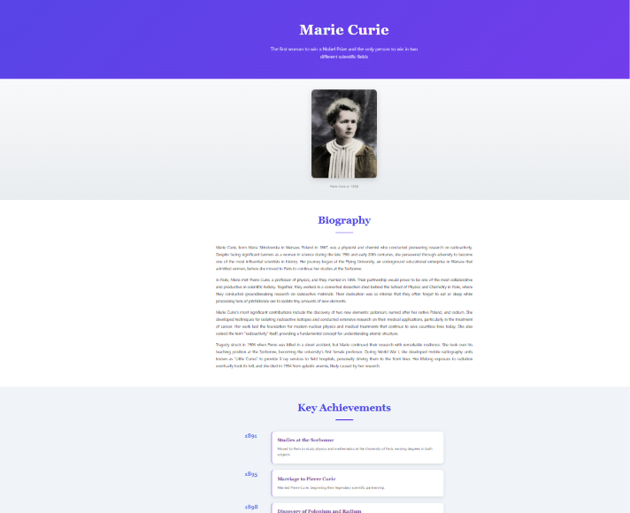
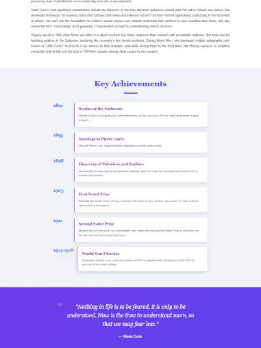

# Tribute Page - Marie Curie

A visually engaging tribute page dedicated to Marie Curie, the pioneering physicist and chemist who conducted groundbreaking research on radioactivity.

## Project Overview

This project is a tribute page created as part of the OIBSIP Level 2 Task 2 assignment. It showcases the life and achievements of Marie Curie, the first woman to win a Nobel Prize and the only person to win in two different scientific fields.

## Features

- **Hero Section**: Page title with Marie Curie's name and a compelling tagline
- **Prominent Image**: Historical photograph from Wikimedia Commons (public domain)
- **Biography Section**: Four detailed paragraphs covering her life, work, and legacy
- **Timeline Section**: Key achievements presented in a styled timeline format
- **Quote Block**: A notable quote from Marie Curie, styled distinctly
- **Responsive Design**: Fully responsive layout that works on desktop, tablet, and mobile devices
- **Multiple Background Colors**: Different background colors across sections for visual variety
- **Font Styling**: Serif fonts for headings and sans-serif for body text

## Tech Stack

- HTML5
- CSS3
- No JavaScript required

## How to Use

1. Clone the repository:
   ```bash
   git clone https://github.com/Pavanigajjela/OIBSIP-L2-Task2-Tribute.git
   ```

2. Navigate to the project directory:
   ```bash
   cd TributePage
   ```

3. Open `index.html` in your web browser

## Project Structure

```
TributePage/
├── index.html          # Main HTML file with title card overlay
├── styles.css          # CSS styling
├── screenshot1.png     # Desktop view screenshot
├── screenshot2.png     # Mobile view screenshot
└── README.md           # Project documentation
```

## Design Features

### Color Scheme
- Primary gradient: Purple (#667eea to #764ba2)
- Light backgrounds: #f8f9fa, #f0f4f8, #ffffff
- Dark footer: #2c3e50

### Typography
- Headings: Georgia, Times New Roman (serif)
- Body text: Segoe UI, Tahoma, Geneva, Verdana (sans-serif)

### Responsive Breakpoints
- Desktop: Default styles
- Tablet: 768px and below
- Mobile: 480px and below

## Output Screenshots

### Desktop View


### Mobile View


## Image Credits

Portrait of Marie Curie sourced from Science Photo Library:
https://media.sciencephoto.com/image/c0031534/800wm/C0031534-Marie_Curie.jpg

## Research Sources

Information about Marie Curie was researched from:
- Wikipedia
- Britannica Encyclopedia

Content has been paraphrased and is original writing based on historical facts.

## License

This project is open source and available for educational purposes.

## Author

Created by Pavanigajjela for OIBSIP Level 2 Task 2 assignment.
